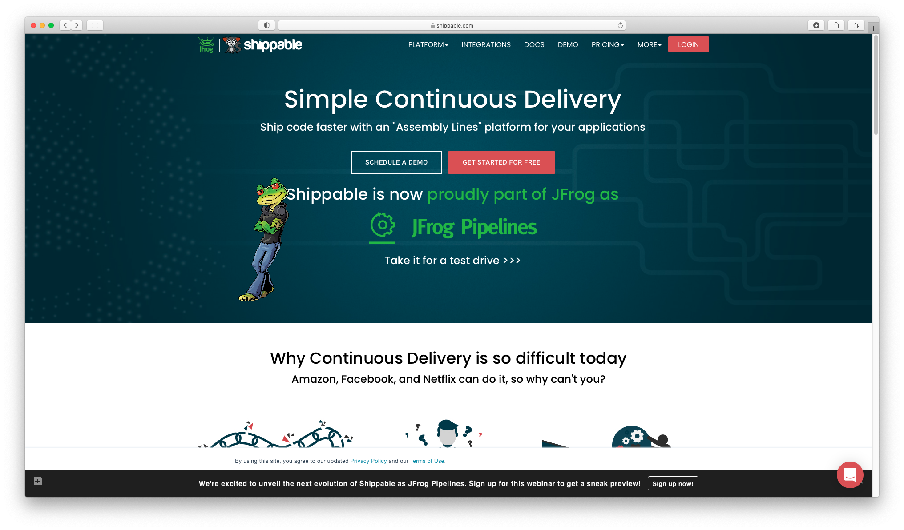
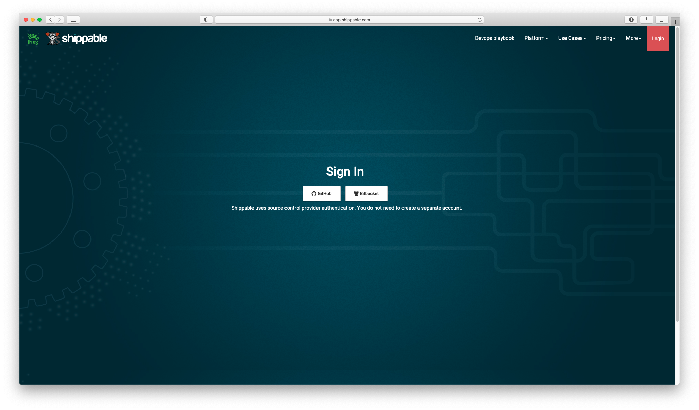
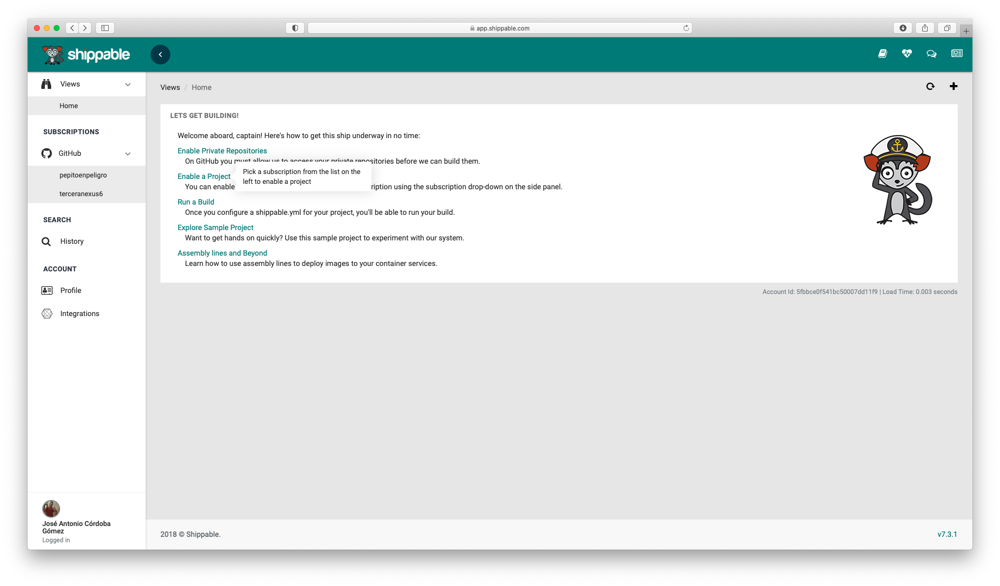
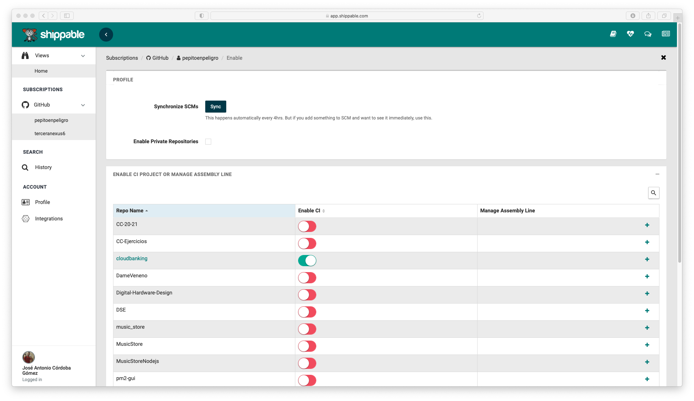

## Code and Test advance. Other additional work


#### Jenkins :x:

```yaml
package_upgrade: true
write_files:
  - path: /etc/systemd/system/docker.service.d/docker.conf
    content: |
      [Service]
        ExecStart=
        ExecStart=/usr/bin/dockerd
  - path: /etc/docker/daemon.json
    content: |
      {
        "hosts": ["fd://","tcp://127.0.0.1:2375"]
      }
runcmd:
  - sudo apt update -y
  # Getting openjdk8
  - sudo apt-get install openjdk-8-jre-headless -y
  # Getting jenkins apt-keys
  - wget -q -O - https://pkg.jenkins.io/debian-stable/jenkins.io.key | sudo apt-key add -
  - sudo sh -c 'echo deb http://pkg.jenkins.io/debian-stable binary/ > /etc/apt/sources.list.d/jenkins.list'
  - sudo apt update -y
  - sudo apt install jenkins -y
  # Getting docker
  - curl -sSL https://get.docker.com/ | sh
  - usermod -aG docker jenkins
  # Stating jenkins service
  - sudo systemctl start jenkins
  - sudo ufw allow 8080
```


We were unable to get Jenkins to update the status of the repository through the Github api. In addition, as it is self hosted, it consumes azure credits and we decided to turn off the machine


#### Shippable CI :x:

The attempt was unsuccessful as Shippable is not available for my language.











